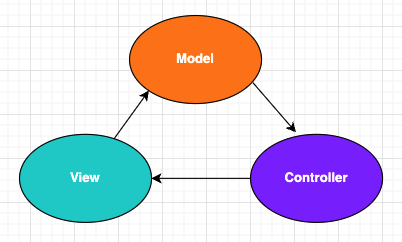
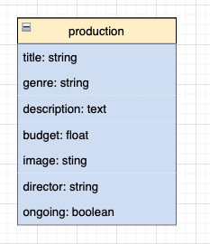

# Intro to Rails
## SWBATs
- [ ] Review MVC
- [ ] Review route writing
- [ ] Review creating a controller action
- [ ] Explain what status codes are and why we use them
- [ ] Observe how to use rails generators to accomplish certain tasks
- [ ] Observe how to create migration files and migrate using rails generators
- [ ] Observe how to seed a database
- [ ] Observe how to call Class methods in controller actions
- [ ] Observe how to structure a json response
- [ ] Observe how to return status codes

## Deliverables

Flatiron Theater Company has hired us to build a web app. The app will have Users and Admin accounts. The theater's productions will be viewable to the general public, and users will be able to purchase tickets. 

Review MVC before Demoing   

   

Creating a rails app: 
```rb
rails _6.1.4_ new flatiron-theater --api --minimal -T
``` 

This will create a Rails application using version 6.

Lets explore the file structure of the app and important files and folders.

Rails generators: 
- `rails g`
- `rails g migration`
- `rails g model`
- `rails g controller`
- `rails g resource`
- `rails g scaffold`

Create a migration model and controller for production using the information from following image for reference:



Demo seeds
- Migrate and create production seeds

Demo rails routes 
- Create a custom route `get "/productions", to: "productions#index"`
- use `rails routes` in the terminal to confirm the route
Demo controller actions 
- Create an index controller action.
	- Access the model with Production.all
	- render the productions in json
	- add a status of ok
	- spin up the server with `rails s`
	- verify your one route is working in the browser


